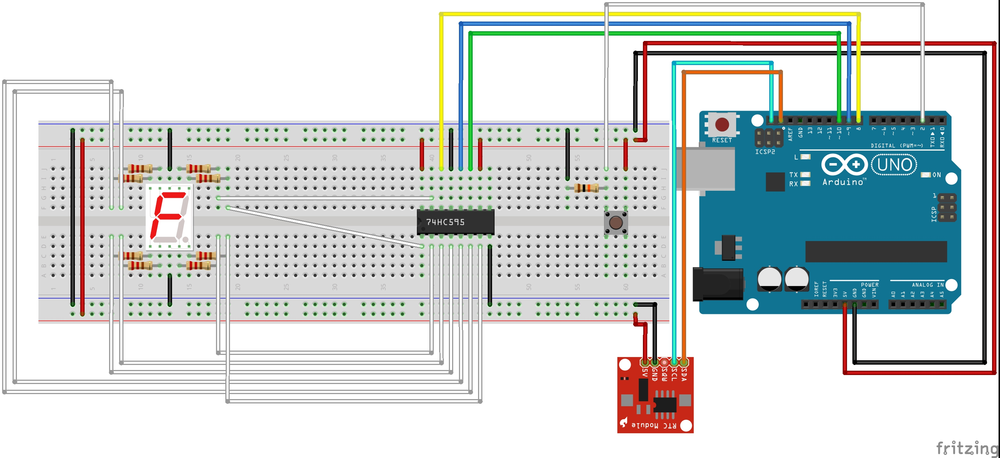

# Readme document voor RTC Project 1
## Authors
* **R. Boudewijn** - [nxttx](https://github.com/nxttx)

## Klok door middel van segment display 

Dit programma is een klok die je kan besturen door middel een knop. Wanneer je de arduino aansluit zoals op figuur 1 kan je de tijd zien.

De klok heeft 4 modussen:

 - Modus 1:	In modus 1 zie je in welk kwartier je zit. Tussen 53 en 07
   minuten is kwartier 1, tussen 08 en 23 is kwartier 2 etc etc.
 - Modus 2:	Modus 2 laat de uren zien in AM of PM stand. De DP led van
   de segment display laat hierbij zien of het AM of PM is. Wanneer deze
   oplicht is het PM.
 - Modus 3:	Modus 3 laat de dagen zien. Aangezien er ongeveer 30 dagen
   in een maand zitten breakt hij bij 15, wanneer de DP led van het
   segment display opnieuw aan is moet je een tel som maken van 15+ het
   getal van de display. Wanneer je dat hebt gedaan heb je de dag van
   vandaag.
 - Modus 4: Modus 4 laat zien in welke maand je zit.

Je kan door de modussen scrollen door op de knop te drukken. 
